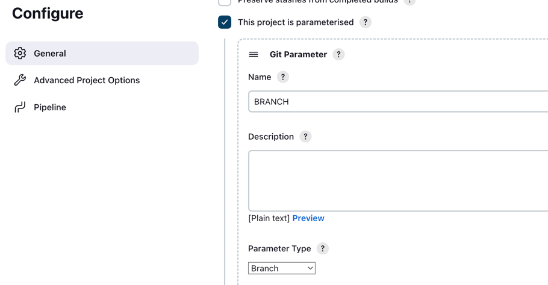
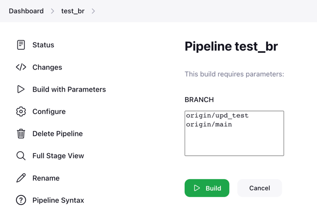
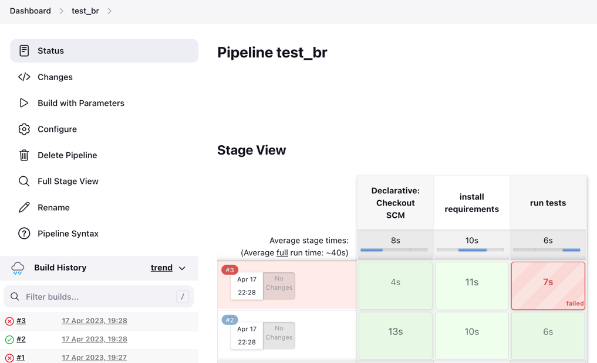
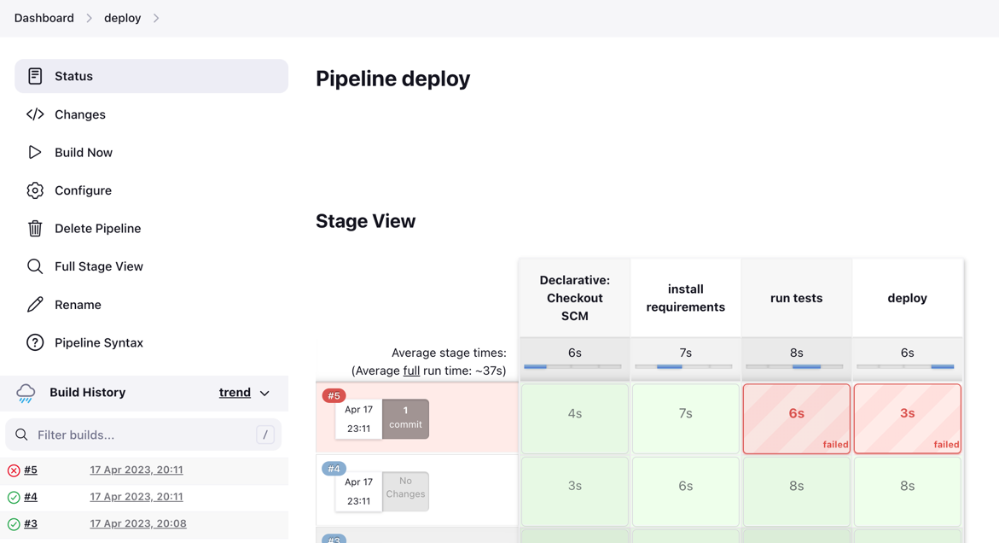
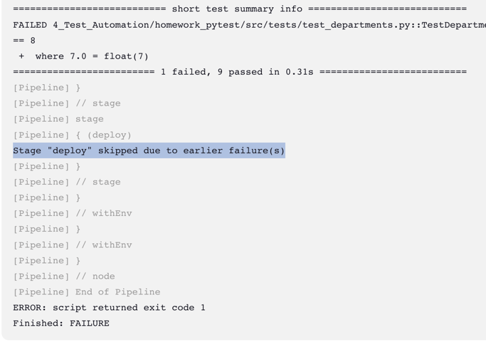

## Branching strategy
For a small project, Trunk-based development can be a simple and effective approach to streamline the development process.
Instead of creating and managing multiple branches, developers can make changes directly in the main branch, reducing the overhead and the complexity of the development process.

Justification of Trunk-based branching strategy choice
1. Reduces the amount of work needed to manage separate branches for different features. This can save time and effort, which can be especially useful for a small team with limited resources
2. Since the team is focused on developing tests, they may not need the additional complexity of maintaining multiple long-lived feature branches
3. The team is small, there is likely less risk of code conflicts, so the team can work directly on the main branch without fear of disrupting other team members' work

Process for creating a pull request:
1. Create a new branch
2. Make changes
3. Push the branch
4. Create a pull request
5. Run tests on branch
6. Ensure that tests are passing
7. Request a code review
8. Address feedback
9. Merge the pull request
10. Delete the branch

### Run tests for branch

The pipeline test_br is configured to allow running tests on a specific branch of the repository.
For example, a branch was created with a pull request (https://github.com/sudnitsina/DQE/pull/1/) where one test is broken. We run the test_br pipeline specifying this branch and see that the tests have failed. Before merging into the main branch, the tests must be green.
Git Parameter Plugin was used to add the ability to select a branch from those already existing in the repository.

### Deployment pipeline

The 'deploy' pipeline includes running a script for deployment as the last step. 

If the tests fail, this step will not be executed.

